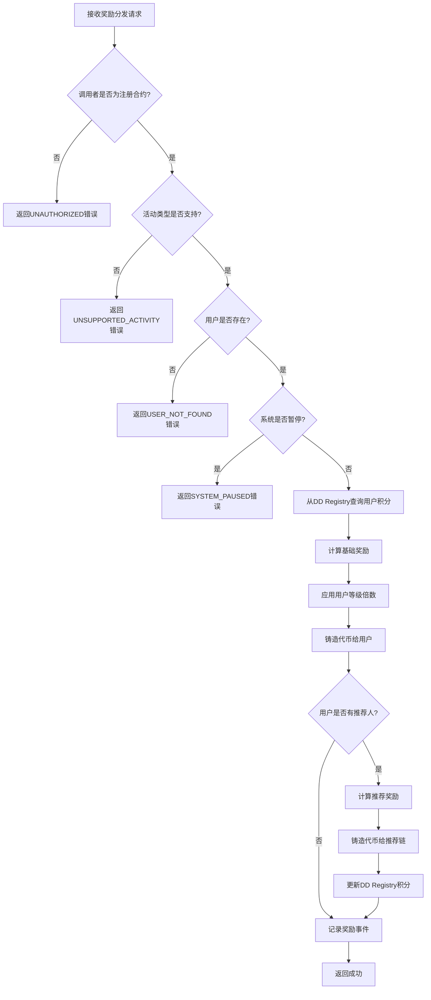
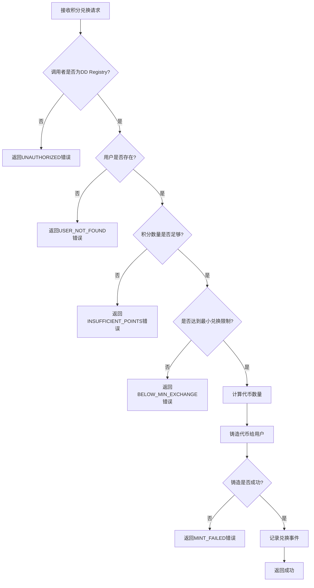

# Luckee Incentive 结构化需求规格说明书

## 📋 文档信息

- **项目名称**: Luckee Incentive (激励合约)
- **版本**: v1.0
- **文档类型**: 结构化需求规格说明书
- **创建日期**: 2024-01-XX
- **最后更新**: 2024-01-XX

## 🎯 项目概述

Luckee Incentive 是一个基于 CosmWasm 的智能合约，专门为 Luckee 生态系统设计，提供全面的激励和奖励分发功能。在重构后的架构中，该合约作为**核心激励引擎**，负责协调其他合约并分发奖励。

## 📊 结构化需求定义

### 1. 奖励计算引擎

#### 1.1 奖励分发 (DistributeReward)

```json
{
  "function_name": "distribute_reward",
  "description": "根据业务事件分发奖励给用户及其推荐链",
  "business_rules": {
    "prerequisite": [
      "调用者必须是注册的业务合约",
      "用户必须已注册",
      "活动类型必须支持",
      "系统未处于紧急暂停状态"
    ],
    "postcondition": [
      "从DD Registry查询用户积分",
      "计算实际奖励金额",
      "铸造代币给用户",
      "分配推荐奖励",
      "记录奖励分发事件"
    ],
    "constraints": {
      "max_reward_per_distribution": "1000000000000000",
      "supported_activity_types": [
        "blind_box_open",
        "nft_mint", 
        "voting",
        "referral_reward",
        "special_event"
      ],
      "referral_reward_rates": {
        "direct": "0.5",
        "level_2": "0.2",
        "level_3": "0.1"
      }
    }
  },
  "input_schema": {
    "type": "object",
    "properties": {
      "activity_type": {
        "type": "string",
        "enum": ["blind_box_open", "nft_mint", "voting", "referral_reward", "special_event"],
        "description": "活动类型"
      },
      "user": {
        "type": "string",
        "pattern": "^luckee[a-z0-9]{38}$",
        "description": "用户地址"
      },
      "activity_data": {
        "type": "object",
        "description": "活动相关数据",
        "properties": {
          "value": {"type": "string"},
          "metadata": {"type": "object"}
        }
      },
      "event_id": {
        "type": "string",
        "description": "事件ID（可选）",
        "nullable": true
      }
    },
    "required": ["activity_type", "user", "activity_data"]
  },
  "output_schema": {
    "type": "object",
    "properties": {
      "success": {"type": "boolean"},
      "total_reward": {"type": "string"},
      "user_reward": {"type": "string"},
      "referral_rewards": {
        "type": "array",
        "items": {
          "type": "object",
          "properties": {
            "user": {"type": "string"},
            "amount": {"type": "string"},
            "level": {"type": "integer"}
          }
        }
      },
      "transaction_hash": {"type": "string"}
    }
  },
  "error_codes": {
    "UNAUTHORIZED": "调用者无权限",
    "USER_NOT_FOUND": "用户不存在",
    "UNSUPPORTED_ACTIVITY": "不支持的活动类型",
    "SYSTEM_PAUSED": "系统已暂停",
    "REWARD_CALCULATION_FAILED": "奖励计算失败",
    "MINT_FAILED": "代币铸造失败"
  }
}
```

#### 1.2 积分兑换 (MintForPoints)

```json
{
  "function_name": "mint_for_points",
  "description": "根据用户积分铸造代币",
  "business_rules": {
    "prerequisite": [
      "调用者必须是DD Registry合约",
      "用户必须已注册",
      "积分数量必须大于0",
      "兑换比例必须有效"
    ],
    "postcondition": [
      "从DD Registry扣除积分",
      "铸造相应数量的代币",
      "记录兑换事件"
    ],
    "constraints": {
      "points_to_token_ratio": "1:1",
      "min_exchange_amount": "1000",
      "max_exchange_per_day": "1000000000000000"
    }
  },
  "input_schema": {
    "type": "object",
    "properties": {
      "user": {
        "type": "string",
        "pattern": "^luckee[a-z0-9]{38}$",
        "description": "用户地址"
      },
      "points_amount": {
        "type": "string",
        "pattern": "^[0-9]+$",
        "minimum": "1000",
        "description": "积分数量"
      }
    },
    "required": ["user", "points_amount"]
  },
  "output_schema": {
    "type": "object",
    "properties": {
      "success": {"type": "boolean"},
      "points_amount": {"type": "string"},
      "token_amount": {"type": "string"},
      "transaction_hash": {"type": "string"}
    }
  },
  "error_codes": {
    "UNAUTHORIZED": "调用者无权限",
    "INSUFFICIENT_POINTS": "积分不足",
    "BELOW_MIN_EXCHANGE": "低于最小兑换限制",
    "MINT_FAILED": "代币铸造失败"
  }
}
```

### 2. 规则管理系统

#### 2.1 规则更新 (UpdateRules)

```json
{
  "function_name": "update_rules",
  "description": "更新激励规则配置",
  "business_rules": {
    "prerequisite": [
      "调用者必须是管理员",
      "规则配置必须有效",
      "系统未处于紧急暂停状态"
    ],
    "postcondition": [
      "规则配置被更新",
      "规则缓存被刷新",
      "记录规则变更事件"
    ],
    "constraints": {
      "max_rule_version": 100,
      "rule_validation": true,
      "backward_compatibility": true
    }
  },
  "input_schema": {
    "type": "object",
    "properties": {
      "rules": {
        "type": "object",
        "properties": {
          "activity_rules": {
            "type": "array",
            "items": {
              "type": "object",
              "properties": {
                "activity_type": {"type": "string"},
                "base_reward": {"type": "string"},
                "multiplier": {"type": "string"},
                "enabled": {"type": "boolean"}
              }
            }
          },
          "referral_rules": {
            "type": "object",
            "properties": {
              "direct_rate": {"type": "string"},
              "level_2_rate": {"type": "string"},
              "level_3_rate": {"type": "string"}
            }
          },
          "level_multipliers": {
            "type": "object",
            "properties": {
              "Bronze": {"type": "string"},
              "Silver": {"type": "string"},
              "Gold": {"type": "string"},
              "Platinum": {"type": "string"}
            }
          }
        }
      },
      "version": {
        "type": "integer",
        "minimum": 1,
        "description": "规则版本号"
      }
    },
    "required": ["rules", "version"]
  },
  "output_schema": {
    "type": "object",
    "properties": {
      "success": {"type": "boolean"},
      "new_version": {"type": "integer"},
      "updated_rules": {"type": "object"}
    }
  },
  "error_codes": {
    "UNAUTHORIZED": "调用者无权限",
    "INVALID_RULES": "无效的规则配置",
    "VERSION_CONFLICT": "版本冲突",
    "RULE_VALIDATION_FAILED": "规则验证失败"
  }
}
```

### 3. 合约协调管理

#### 3.1 合约注册 (RegisterContract)

```json
{
  "function_name": "register_contract",
  "description": "注册业务合约",
  "business_rules": {
    "prerequisite": [
      "调用者必须是管理员",
      "合约地址必须有效",
      "合约类型必须支持"
    ],
    "postcondition": [
      "合约被注册到白名单",
      "权限被设置",
      "记录注册事件"
    ],
    "constraints": {
      "max_registered_contracts": 100,
      "supported_contract_types": [
        "blind_box",
        "nft",
        "voting",
        "registry"
      ]
    }
  },
  "input_schema": {
    "type": "object",
    "properties": {
      "contract_address": {
        "type": "string",
        "pattern": "^luckee[a-z0-9]{38}$",
        "description": "合约地址"
      },
      "contract_type": {
        "type": "string",
        "enum": ["blind_box", "nft", "voting", "registry"],
        "description": "合约类型"
      },
      "permissions": {
        "type": "array",
        "items": {
          "type": "string",
          "enum": ["distribute_reward", "query_points", "mint_tokens"]
        },
        "description": "权限列表"
      }
    },
    "required": ["contract_address", "contract_type", "permissions"]
  },
  "output_schema": {
    "type": "object",
    "properties": {
      "success": {"type": "boolean"},
      "contract_id": {"type": "string"},
      "registered_at": {"type": "integer"}
    }
  },
  "error_codes": {
    "UNAUTHORIZED": "调用者无权限",
    "INVALID_CONTRACT": "无效的合约地址",
    "CONTRACT_ALREADY_EXISTS": "合约已存在",
    "INVALID_PERMISSIONS": "无效的权限配置"
  }
}
```

#### 3.2 状态同步 (SyncState)

```json
{
  "function_name": "sync_state",
  "description": "与其他合约同步状态",
  "business_rules": {
    "prerequisite": [
      "调用者必须是注册的合约",
      "同步类型必须支持",
      "数据格式必须有效"
    ],
    "postcondition": [
      "状态被同步",
      "缓存被更新",
      "记录同步事件"
    ],
    "constraints": {
      "sync_frequency": "实时",
      "max_sync_data_size": "1MB",
      "sync_timeout": 30000
    }
  },
  "input_schema": {
    "type": "object",
    "properties": {
      "sync_type": {
        "type": "string",
        "enum": ["user_points", "referral_chain", "rules_update"],
        "description": "同步类型"
      },
      "data": {
        "type": "object",
        "description": "同步数据"
      },
      "timestamp": {
        "type": "integer",
        "description": "数据时间戳"
      }
    },
    "required": ["sync_type", "data", "timestamp"]
  },
  "output_schema": {
    "type": "object",
    "properties": {
      "success": {"type": "boolean"},
      "synced_at": {"type": "integer"},
      "data_hash": {"type": "string"}
    }
  },
  "error_codes": {
    "UNAUTHORIZED": "调用者无权限",
    "INVALID_SYNC_TYPE": "无效的同步类型",
    "SYNC_DATA_INVALID": "同步数据无效",
    "SYNC_TIMEOUT": "同步超时"
  }
}
```

### 4. 查询功能

#### 4.1 奖励历史查询 (GetRewardHistory)

```json
{
  "function_name": "get_reward_history",
  "description": "查询用户奖励历史",
  "business_rules": {
    "prerequisite": [
      "用户地址必须有效",
      "查询参数必须有效"
    ],
    "postcondition": [
      "返回奖励历史记录"
    ],
    "constraints": {
      "max_history_records": 1000,
      "max_query_period": 365,
      "default_limit": 50
    }
  },
  "input_schema": {
    "type": "object",
    "properties": {
      "user": {
        "type": "string",
        "pattern": "^luckee[a-z0-9]{38}$",
        "description": "用户地址"
      },
      "limit": {
        "type": "integer",
        "minimum": 1,
        "maximum": 1000,
        "description": "返回数量限制",
        "default": 50
      },
      "offset": {
        "type": "integer",
        "minimum": 0,
        "description": "偏移量",
        "default": 0
      },
      "activity_type": {
        "type": "string",
        "enum": ["blind_box_open", "nft_mint", "voting", "referral_reward", "special_event"],
        "description": "活动类型过滤（可选）",
        "nullable": true
      }
    },
    "required": ["user"]
  },
  "output_schema": {
    "type": "object",
    "properties": {
      "reward_history": {
        "type": "array",
        "items": {
          "type": "object",
          "properties": {
            "timestamp": {"type": "integer"},
            "activity_type": {"type": "string"},
            "amount": {"type": "string"},
            "event_id": {"type": "string", "nullable": true},
            "transaction_hash": {"type": "string"}
          }
        }
      },
      "total_rewards": {"type": "string"},
      "total_count": {"type": "integer"}
    }
  }
}
```

#### 4.2 系统统计查询 (GetSystemStats)

```json
{
  "function_name": "get_system_stats",
  "description": "查询系统统计信息",
  "business_rules": {
    "prerequisite": [
      "系统正常运行"
    ],
    "postcondition": [
      "返回系统统计数据"
    ]
  },
  "input_schema": {
    "type": "object",
    "properties": {
      "period": {
        "type": "string",
        "enum": ["daily", "weekly", "monthly", "all"],
        "description": "统计周期",
        "default": "all"
      }
    },
    "required": []
  },
  "output_schema": {
    "type": "object",
    "properties": {
      "total_rewards_distributed": {"type": "string"},
      "total_users": {"type": "integer"},
      "total_activities": {"type": "integer"},
      "activity_breakdown": {
        "type": "object",
        "properties": {
          "blind_box_open": {"type": "integer"},
          "nft_mint": {"type": "integer"},
          "voting": {"type": "integer"},
          "referral_reward": {"type": "integer"},
          "special_event": {"type": "integer"}
        }
      },
      "average_reward_per_user": {"type": "string"},
      "top_reward_users": {
        "type": "array",
        "items": {
          "type": "object",
          "properties": {
            "user": {"type": "string"},
            "total_rewards": {"type": "string"},
            "activity_count": {"type": "integer"}
          }
        }
      }
    }
  }
}
```

### 5. 业务规则决策树

#### 5.1 奖励分发决策树



#### 5.2 积分兑换决策树



### 6. 活动类型配置

#### 6.1 活动规则定义

```json
{
  "activity_rules": {
    "blind_box_open": {
      "base_reward": "1000000",
      "multiplier": "1.0",
      "description": "盲盒开奖奖励",
      "enabled": true
    },
    "nft_mint": {
      "base_reward": "500000",
      "multiplier": "1.0",
      "description": "NFT铸造奖励",
      "enabled": true
    },
    "voting": {
      "base_reward": "200000",
      "multiplier": "1.0",
      "description": "投票参与奖励",
      "enabled": true
    },
    "referral_reward": {
      "base_reward": "0",
      "multiplier": "1.0",
      "description": "推荐奖励",
      "enabled": true
    },
    "special_event": {
      "base_reward": "2000000",
      "multiplier": "2.0",
      "description": "特殊活动奖励",
      "enabled": false
    }
  }
}
```

#### 6.2 用户等级倍数

```json
{
  "level_multipliers": {
    "Bronze": {
      "multiplier": "1.0",
      "description": "青铜等级"
    },
    "Silver": {
      "multiplier": "1.2",
      "description": "白银等级"
    },
    "Gold": {
      "multiplier": "1.5",
      "description": "黄金等级"
    },
    "Platinum": {
      "multiplier": "2.0",
      "description": "铂金等级"
    }
  }
}
```

### 7. 边界条件

#### 7.1 数值边界

```json
{
  "boundary_conditions": {
    "reward_limits": {
      "min_reward": "1",
      "max_reward_per_distribution": "1000000000000000",
      "max_total_rewards": "1000000000000000000"
    },
    "user_limits": {
      "max_users": 1000000,
      "max_activities_per_user": 10000,
      "max_referral_depth": 3
    },
    "contract_limits": {
      "max_registered_contracts": 100,
      "max_sync_data_size": "1MB",
      "max_query_records": 1000
    }
  }
}
```

#### 7.2 异常处理

```json
{
  "exception_handling": {
    "overflow_protection": {
      "description": "防止奖励溢出",
      "implementation": "使用Uint128类型，检查运算结果"
    },
    "underflow_protection": {
      "description": "防止奖励下溢",
      "implementation": "检查余额是否足够"
    },
    "reentrancy_protection": {
      "description": "防止重入攻击",
      "implementation": "状态更新优先于外部调用"
    },
    "contract_call_protection": {
      "description": "防止合约调用失败",
      "implementation": "错误处理和重试机制"
    }
  }
}
```

## 📝 变更记录

| 版本 | 日期 | 变更内容 | 变更人 |
|------|------|----------|--------|
| v1.0 | 2024-01-XX | 初始版本创建 | AI Assistant |

---

**注意**: 本文档是AI生成代码和测试用例的直接输入，包含所有业务逻辑的决策树和边界条件。任何功能变更都必须同步更新本文档。
